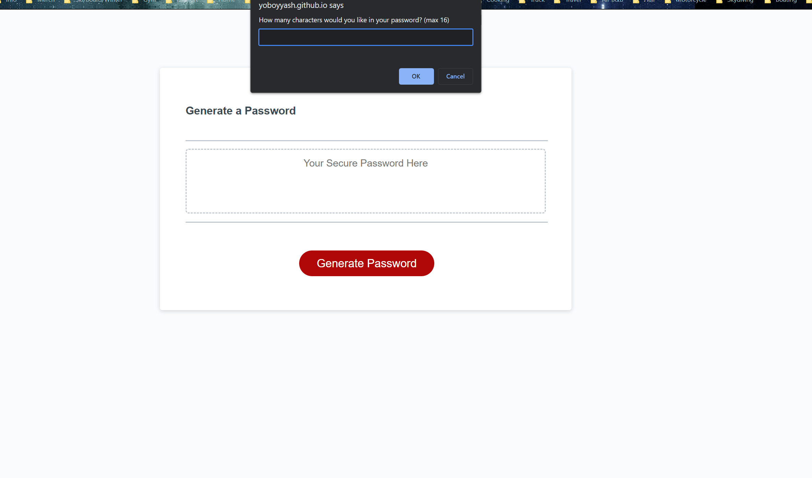

# Password Generator 

## A 16 character random password generator! 

HOW TO USE: Enter the number of characters you would like in your desired password. Check on or off Uppercase, Lowercase, Numbers and Symbols to include or not in you password and submit! You will be provided with a password! 

This project is helping me build a webapp so that I know how to go about creating not just a fully interactive webpage with stylesheet and script but also add functions that I find suitable to solve acceptance criteria. I understand in the future of web developement I will be required to meet everything asked according to the client anyone I work for. This assignment really helped me navigate on my own how to research and apply code to meet requirements whilst keeping the visual design intergrity of the original code.

Along with being tested on understanding of creating a webapp I am adding something valuable to my job seeking tools. Every part of this project is sample code which shows how to do the following:

 * Add functions that are unique and meets the requirement of the password creation to accomplish results for users   
 * Create prompts that assist user on the webapp to input their data and continue to navigate the webpage for results
 * Create a html, css, and js file
 * Create a repository on github and use gitbash terminal to locally keep code files updated online
 * Deploy all built code to gitpages so to have a website
 * Structure code schemantics in a way so you or anyone else can continue working on this project in the future 

## Visit the Website!
https://yoboyyash.github.io/EPIC-Password-Generator/

## Visit the Repository!
https://github.com/yoboyyash/EPIC-Password-Generator

## Found a bug?

If you have found a bug or elements of the project that you think you can improve. Contact me!

yashrajbaviskar@gmail.com

Thank you!

You can also donate/buy me a coffee, venmo: @Yash-Baviskar, Zelle: 832 335 4263